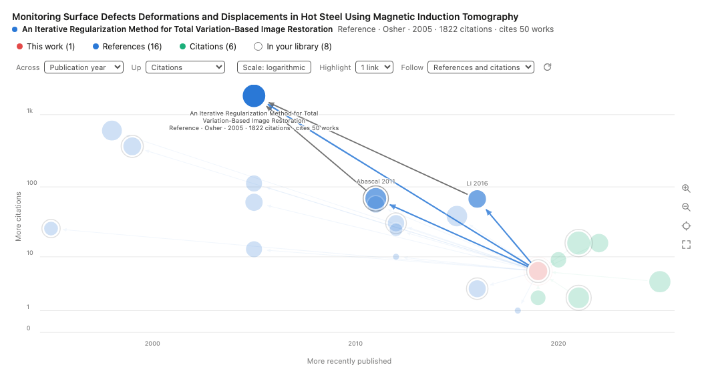
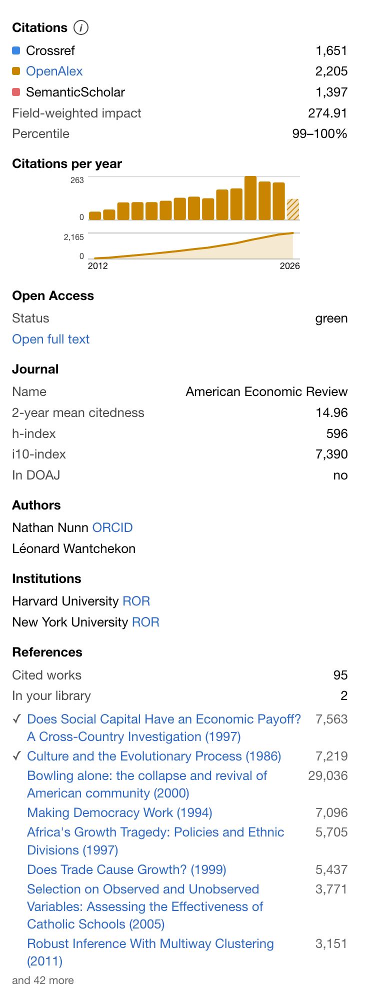

# Orbit

> A Zotero plugin that puts a paper in context: how often it has been cited, according to whom, what it builds on, and what has built on it since.

[](https://www.zotero.org/)
[](https://www.gnu.org/licenses/agpl-3.0)
[](https://opensource.org/licenses/MPL-2.0)




Five sources disagree about how often a paper has been cited, and the
disagreement is often the interesting part. Orbit shows them side by side,
puts the record behind the numbers in the item pane, and draws a paper's
surroundings as a graph you can walk.

## What it adds

### A Citations column

Counts from Crossref, OpenAlex, Semantic Scholar, INSPIRE and Google Scholar,
in the order you choose, each in its own colour, separated by `|`. Hovering a
cell says which number came from where.

There is a second, sortable column for OpenAlex's field-weighted citation
impact — how a paper compares to others of its field, year and type, where 1.0
is average.

### An item pane section



The same counts, spelled out and linked to their sources — the disagreement
above is real, and it is the ordinary case rather than a bad day. Then the
OpenAlex record behind the numbers: citations per year as a chart with a
running total, the field-weighted impact and its percentile, open-access status
with a link to the full text, journal metrics, authors with their ORCIDs,
institutions with their RORs, funding, and a retraction warning where there is
one.

Underneath, the works this paper cites, resolved through Semantic Scholar,
which finds consistently more of them than OpenAlex does. Each is marked if it
is already in your library, and clicking it goes there.

### A graph tab

Right-click an item → **Citation graph**. It plots what the paper cites and
what cites it, and the picture above is what that looks like.

- **Both axes are yours to choose** — publication year, citations, or
  references cited. Logarithmic or linear, where the axis is a count.
- **Mark size** is how many works each one cites, so a review stands apart from
  a letter. Citations already own an axis; size says something else.
- **Arrows run from the citing work to the cited one**, so the direction of
  influence is drawn rather than inferred.
- **A ring** means the work is already in your library. The legend doubles as a
  filter: click an entry to take that group out, or cycle the ring between all
  works, only the ones you have, and only the ones you do not.
- **Pointing at a mark** dims the rest, spells out its title, fills the strip
  above the plot, and lights the paths between it and its neighbours — the
  citations _among_ the surrounding works, which is where a line of descent
  becomes visible. How far the highlight reaches, and in which direction, are
  both settings.
- **Clicking a mark** holds that state and opens a card: the full record, a
  link to the work at Semantic Scholar and at its publisher, and a button to
  open a graph from that work — whether or not you have it.
- Scroll to zoom, drag to pan, Shift or Alt to stretch one axis alone. Marks
  keep their size, so zooming pulls a crowded field apart instead of
  magnifying it, and names appear as room is made for them.

## Requirements

Zotero 10. Orbit has no releases before it; for Zotero 7, 8 or 9 use
[Citation Tally](https://github.com/daeh/zotero-citation-tally/releases),
which Orbit is forked from.

## Installation

1. Download `orbit.xpi` from the [latest release](https://github.com/fkallmer/zotero-orbit/releases/latest).
2. In Zotero: `Tools → Plugins`, then `Install Plugin From File…` from the gear icon ⛭.
3. Choose the file, and restart Zotero.

If the Citations column does not appear, right-click the column headers and
tick **Citations**.

## Settings

`Zotero → Settings → Orbit` on macOS, `Edit → Settings → Orbit` elsewhere.

|                              |                                                                                                                                                                                                                                                                                                                           |
| ---------------------------- | ------------------------------------------------------------------------------------------------------------------------------------------------------------------------------------------------------------------------------------------------------------------------------------------------------------------------- |
| **Databases**                | Which sources to use and in what order. Default `crossref, semanticscholar`; for physics, `inspire, crossref, semanticscholar` is usually better.                                                                                                                                                                         |
| **Fetch for new items**      | On. Counts are looked up as you add items.                                                                                                                                                                                                                                                                                |
| **Automatic updates**        | Off. Turn on to refresh missing and outdated counts at the next start.                                                                                                                                                                                                                                                    |
| **Outdated after**           | 3, 6, 12 or 24 months. Default 6.                                                                                                                                                                                                                                                                                         |
| **Colours**                  | On. Each source gets its own colour when more than one is shown.                                                                                                                                                                                                                                                          |
| **Semantic Scholar API key** | Optional but worth having. Without one you share an anonymous pool with every other client, so lookups are slower and fail more. Request one at [semanticscholar.org/product/api](https://www.semanticscholar.org/product/api). Zotero stores it unencrypted in its preferences; Orbit sends it only to Semantic Scholar. |

Orbit looks work up **by DOI or arXiv ID only** — never by title, ISBN or PMID.
Journal articles and conference papers usually carry a DOI; web pages, theses
and datasets often carry neither. The DOI field is read first, then Archive ID,
Report Number, Extra, URL and Call Number for an arXiv ID.

New items are tallied as they arrive; existing ones are not backfilled. To
catch up, run `Tools → Retally outdated item citations`, or select items,
right-click, and choose **Update Citation Tallies**.

## How it behaves under load

Every source paces itself, so a large update takes a while by design.

Crossref and INSPIRE start at one request per second and are throttled
independently: a rate-limit error multiplies the delay by 1.5 up to ten times
the base, and each success eases it back by 0.9, never below the base.
Semantic Scholar runs its own scheduler — at least 1 second between keyed
requests, 3 seconds without a key — and backs off exponentially with full
jitter on a transient failure, never sooner than the server's `Retry-After`.
OpenAlex is asked politely: give it a contact address (see _Building_) and it
raises the limits.

A source that comes up empty for an item is not asked again immediately: 7
days after the first failure, then 30, then 90, then 180. Selected-item updates
bypass that schedule. A library scan will not start if Zotero is offline, and
stops between items if it goes offline part way.

Records are cached on disk. The graph's reload button is the way past that,
when a paper has picked up citations or the library has gained the work.

## Sources

|                                                      |                                                                         |
| ---------------------------------------------------- | ----------------------------------------------------------------------- |
| [Crossref](https://www.crossref.org/)                | DOI registration agency; broad coverage of journals and conferences     |
| [OpenAlex](https://openalex.org/)                    | Open catalogue of works; the record behind the item pane, and the graph |
| [Semantic Scholar](https://www.semanticscholar.org/) | AI2's index; the reference lists, and influential-citation counts       |
| [INSPIRE](https://inspirehep.net/)                   | High-energy physics                                                     |
| Google Scholar                                       | Broadest coverage, no API; scraped, and rate-limited accordingly        |

## Building

```sh
yarn install
yarn build          # → .scaffold/build/orbit.xpi
yarn test:unit
yarn test:coverage  # runs the suite and rewrites the coverage badges above
```

Every build raises the patch version. Zotero keys an installed plugin by
version, and two builds sharing one are the same plugin as far as it is
concerned — reinstalling can leave the old code in place.

OpenAlex offers a faster request pool to callers who identify themselves. Put
an address in `.orbit-contact` (untracked) or set `ORBIT_CONTACT`, and it is
substituted into the build. Leave it unset and Orbit uses the common pool,
which is slower but works. The address is deliberately not in this repository:
it identifies whoever runs the build, and a fork must not go on sending an
address that is not theirs.

## Credit

Orbit is not written from nothing. Two projects carry most of what makes it
work, and both are named here because a licence file is a legal minimum and not
the same thing as saying who did the work.

### Citation Tally — Dae Houlihan

[daeh/zotero-citation-tally](https://github.com/daeh/zotero-citation-tally),
AGPL-3.0. Orbit is a fork of it and inherits its licence.

That project is the foundation: the citation-count column, the provider
framework the sources plug into, the rate limiting with its backoff ladder and
circuit breaker, the preferences, the storage in the item's Extra field, and
the build. Everything Orbit adds sits on top of it.

Added here: the OpenAlex and Google Scholar providers, the item pane section
with the record and the yearly chart, the reference list from Semantic Scholar,
the field-weighted-impact column, and the graph tab.

### Google Scholar Citation Count — Justin Ribeiro

[justinribeiro/zotero-google-scholar-citation-count](https://github.com/justinribeiro/zotero-google-scholar-citation-count),
MPL-2.0, included as `LICENSE-MPL-2.0`.

`src/modules/googleScholarClient.core.ts` is derived from it and stays under
MPL-2.0 while the rest of Orbit is AGPL-3.0; section 3.3 of the MPL expressly
allows that combination. The file was rewritten in TypeScript, but the
substance is that project's: which markers in Scholar's HTML identify a result
and its citation count, and the distinction between a page carrying a result
but no count, which means zero, and a page carrying no result at all, which
means unknown. Scholar publishes no API and no schema for any of this; it was
worked out against the live site, and that is the expensive part.

### Also

Built on [zotero-plugin-scaffold and zotero-plugin-toolkit](https://github.com/windingwind)
by windingwind. Related work worth knowing about:
[ZoteroCitationCountsManager](https://github.com/FrLars21/ZoteroCitationCountsManager)
by FrLars21 and [zotero-citationcounts](https://github.com/eschnett/zotero-citationcounts)
by eschnett.

## License

GNU Affero General Public License v3.0, with one exception:
`src/modules/googleScholarClient.core.ts` is under the Mozilla Public License
2.0. See `LICENSE` and `LICENSE-MPL-2.0`.
